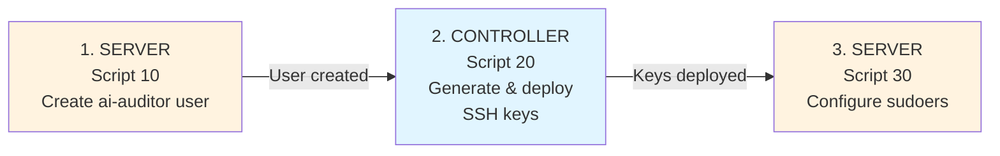

# Phase 1 Setup Scripts

## Overview

These scripts implement Phase 1 of the AI Auditor service account deployment:
- Create restricted user account
- Configure SSH key authentication  
- Set up minimal sudoers for proof-of-concept (uname only)

Each script is **idempotent** — safe to run multiple times.

---

## Machine Architecture

Scripts run on DIFFERENT machines in a specific order:



---

## Execution Order

**CRITICAL: Follow this exact order:**

1. **On SERVER:** Run `10-create-user.sh` (creates the `ai-auditor` user)
2. **On CONTROLLER:** Run `20-setup-ssh-keys.sh` (generates keys, deploys public key to server)
3. **On SERVER:** Run `30-configure-sudoers.sh` (configures minimal sudoers for Phase 1)

```bash
# ============================================
# STEP 1: ON SERVER MACHINE (target) 
# ============================================
# Copy scripts 10 and 30 to server (not 20!)
scp modules/audit/scripts/setup/10-create-user.sh modules/audit/scripts/setup/30-configure-sudoers.sh user@server:/tmp/setup/
# Also copy the sudoers template from repo root
scp config/sudoers-ai-auditor-template user@server:/tmp/setup/

# SSH to server
ssh user@server
cd /tmp/setup

# Run script 10 to create the ai-auditor user
sudo bash 10-create-user.sh

# OR: With verbose output for debugging
sudo bash 10-create-user.sh -v

# Display help
bash 10-create-user.sh -h

# ============================================
# STEP 2: ON CONTROLLER MACHINE (your machine)
# ============================================
# Navigate to repository root
cd /path/to/ai-systems-admin-framework

# Run script 20 from the repo (sources lib/common.sh automatically)
# This will fail with clear error if user doesn't exist on server (expected)
bash modules/audit/scripts/setup/20-setup-ssh-keys.sh -s user@192.168.1.100

# OR: Specify custom controller name
bash modules/audit/scripts/setup/20-setup-ssh-keys.sh -s user@192.168.1.100 -c laptop-dev

# Display help
bash modules/audit/scripts/setup/20-setup-ssh-keys.sh -h

# ============================================
# STEP 3: ON SERVER MACHINE (target) - AGAIN
# ============================================
# SSH back to server (if not still connected)
ssh user@server
cd /tmp/setup

# Run script 30 to configure sudoers
sudo bash 30-configure-sudoers.sh

# OR: With verbose output for debugging
sudo bash 30-configure-sudoers.sh -v

# Display help
bash 30-configure-sudoers.sh -h
```

**Important Notes:**
- Script 20 **must run from the repository** (not copied to server)
- Script 20 will automatically fail if script 10 hasn't been run first (it verifies ai-auditor user exists)
- This safety guard prevents misconfiguration

**Controller Machine Name (optional for script 20):** 
- If omitted: uses your machine's hostname automatically (e.g., `laptop`, `workstation-dev`)
- If specified: use custom identifier for clarity
  - `laptop-dev` for your development laptop
  - `controller-prod-01` for production controller
  - `ci-pipeline-jenkins` for CI/CD system

The controller name will be included as a comment in the public key, making it easy to identify and revoke keys.

---

## What Each Script Does

### 10-create-user.sh

**Purpose:** Create `ai-auditor` system account with locked password

**Runs on:** SERVER/TARGET MACHINE

**Parameters (flags):**
- `-v, --verbose` Display detailed output for debugging
- `-h, --help` Display help message

**Usage:**
```bash
sudo bash 10-create-user.sh
sudo bash 10-create-user.sh -v
bash 10-create-user.sh -h
```

**Actions:**
- Creates user with UID < 1000 (system account)
- Sets shell to `/bin/bash`
- Locks password (no password login possible)
- Configures minimal `.bashrc` (no history, safe PATH)
- Creates `.ssh` directory structure (700 permissions)

**Verification:** Checks all 5 components at end

**Idempotent:** If user already exists, skips creation but verifies settings

**Time:** ~10 seconds

---

### 20-setup-ssh-keys.sh

**Purpose:** Generate SSH keypair on controller and deploy public key to server

**Runs on:** CONTROLLER/CLIENT MACHINE (your machine, not the server!)

**Requirements:**
- Must be run FROM THE REPOSITORY (not copied to other locations)
- Requires `lib/common.sh` as a dependency (acts as safety guard)
- If accidentally copied to another location and run, it will fail with clear error message

**Parameters (flags):**
- `-s, --server <address>` [REQUIRED] Server address (user@host or IP)
- `-c, --controller <name>` [OPTIONAL] Controller name (defaults to current machine hostname)
- `-h, --help` Display help message

**Usage:**
```bash
# IMPORTANT: Run from repository, not copied

# Use current hostname as controller name (simplest)
bash modules/audit/scripts/setup/20-setup-ssh-keys.sh -s user@192.168.1.100

# Specify custom controller name for clarity
bash modules/audit/scripts/setup/20-setup-ssh-keys.sh -s user@192.168.1.100 -c laptop-dev
bash modules/audit/scripts/setup/20-setup-ssh-keys.sh -c controller-prod-01 -s ubuntu@prod-server.example.com

# Parameters can be in any order
bash modules/audit/scripts/setup/20-setup-ssh-keys.sh -s 192.168.1.100 -c prod-server

# Display help
bash modules/audit/scripts/setup/20-setup-ssh-keys.sh -h
```

**Actions:**
- Validates server address via SSH connection test
- **Verifies ai-auditor account exists on server** (script 10 must be run first)
- Detects hostname if controller name not provided
- Generates ED25519 keypair on controller with controller name in comment
- Deploys public key to `/opt/ai-auditor/.ssh/authorized_keys` on server
- Sets strict permissions on files
- Tests SSH connection with new key

**Prerequisites (must run first):**
- Script 10 must have been executed on the server (creates the ai-auditor user)
- If the user doesn't exist, this script will fail with a clear error message telling you to run script 10 first

**Key Identification:**
Each key is labeled with the controller machine name in its SSH comment:
```
ssh-ed25519 AAAAC3... laptop@auditing-framework
ssh-ed25519 AAAAC3... controller-prod-01@auditing-framework
```
This makes it easy to identify which keys belong to which machines for revocation.

**Multiple Controllers:** 
If you need access from multiple machines, run this script once from each machine (from the repository):
```bash
# On laptop (run from the repo)
cd /path/to/ai-systems-admin-framework
bash modules/audit/scripts/setup/20-setup-ssh-keys.sh -s user@server

# On workstation (run from the repo)
cd /path/to/ai-systems-admin-framework
bash modules/audit/scripts/setup/20-setup-ssh-keys.sh -s user@server -c workstation

# On CI/CD system (run from the repo)
cd /path/to/ai-systems-admin-framework
bash modules/audit/scripts/setup/20-setup-ssh-keys.sh -s user@server -c ci-jenkins
```
Public keys are appended to authorized_keys, each with its own identifier.

**Safety Guard:**
This script sources `lib/common.sh` as a dependency. If someone accidentally copies it to another location and tries to run it, it will fail with a clear error message explaining:
- Why it failed (common.sh not found)
- Where the script must run (from the repository)
- How to fix it (proper usage instructions)

This prevents accidental misconfiguration if the script is copied to the wrong location.

**Security Model:**
- Private key stays on controller machine (never leaves)
- Public key deployed to server for authentication
- Keys identified by hostname/controller name for easy revocation
- SSH required for key deployment (not manual SCP)

**Idempotent:** If run again with same controller name, skips regeneration (keys already exist)

**Time:** ~15 seconds (plus SSH network latency)

---

### 30-configure-sudoers.sh

**Purpose:** Deploy Phase 1 sudoers configuration (uname proof-of-concept only)

**Runs on:** SERVER/TARGET MACHINE

**Parameters (flags):**
- `-v, --verbose` Display detailed output for debugging
- `-h, --help` Display help message

**Usage:**
```bash
sudo bash 30-configure-sudoers.sh
sudo bash 30-configure-sudoers.sh -v
bash 30-configure-sudoers.sh -h
```

**Actions:**
- Deploys sudoers template to `/etc/sudoers.d/ai-auditor`
- Validates syntax with `visudo -c`
- Restricts to single command: `uname -a`
- Sets NOPASSWD, env_reset, secure_path
- Creates backup of existing sudoers before overwriting

**Verification:** Checks sudoers permissions and syntax

**Idempotent:** Backs up existing sudoers before overwriting; safe to run multiple times

**Time:** ~5 seconds

---

## Phase 1 Architecture

```
ai-auditor account
├── SSH key authentication only (password locked)
├── Minimal .bashrc (no history, safe PATH)
├── Sudo access to: /usr/bin/uname -a
└── All commands logged to /var/log/sudo-ai-auditor.log
```

**Security Model:**
- SSH key-only access (no password possible)
- Single command in Phase 1 (minimal attack surface)
- Environment hardened (env_reset, secure_path)
- All actions logged
- Explicit DENY all other commands

---

## Testing Phase 1

**Testing is done FROM YOUR CONTROLLER/CLIENT MACHINE**

After running all three scripts on the server and copying the private key:

```bash
# On your controller machine, test SSH access with the key for this machine
ssh -i ~/.ssh/ai-auditor-laptop-dev ai-auditor@<server-address>

# Expected: SSH session opens to ai-auditor@server
# Prompt: ai-auditor$

# Test uname command (should work)
sudo /usr/bin/uname -a
# Output: Linux [hostname] [version] ...

# Exit SSH session
exit

# Test denied command from controller (should fail with permission error)
ssh -i ~/.ssh/ai-auditor-laptop-dev -c "sudo /bin/ls /root" ai-auditor@<server-address>
# Output: ai-auditor is not allowed to run /bin/ls /root on server
```

**Revoking a Key:**

If you need to revoke access from a specific controller machine:

```bash
# On server, edit authorized_keys
sudo nano /opt/ai-auditor/.ssh/authorized_keys

# Find the line with the controller name comment and delete it
# Example: remove line with "controller-prod-01@auditing-framework"
```

**Multiple Controllers:**

Each controller's key can be identified by its comment in authorized_keys:
```bash
# View all authorized keys with their controller identifiers
sudo grep -n @ /opt/ai-auditor/.ssh/authorized_keys
# Output:
# 1:ssh-ed25519 AAAAC3... laptop-dev@auditing-framework
# 2:ssh-ed25519 AAAAC3... controller-prod-01@auditing-framework
```

---

## Troubleshooting

### Script fails with "permission denied"
```bash
# Make sure you're using sudo
sudo bash 10-create-user.sh
```

### "User already exists" but verification fails
```bash
# Manual verification
id ai-auditor
getent passwd ai-auditor
sudo passwd --status ai-auditor
```

### Sudoers deployment fails
```bash
# Check existing sudoers
sudo cat /etc/sudoers.d/ai-auditor

# Validate syntax manually
sudo visudo -c -f /etc/sudoers.d/ai-auditor
```

### SSH key testing fails
```bash
# Check authorized_keys exists
sudo cat /opt/ai-auditor/.ssh/authorized_keys

# Check permissions
sudo ls -la /opt/ai-auditor/.ssh/
```

---

## Phase 2: Next Steps

After Phase 1 is working end-to-end:

1. **Create config/enabled-commands.yaml**
   - Define Phase 2 commands (dpkg, systemctl, etc.)
   - Each with reason, phase, risk_level

2. **Create generator script**
   - Reads YAML → generates sudoers entries
   - Enables easy iteration

3. **Add validation scripts**
   - Test Phase 2 commands work
   - Verify denied commands blocked

---

## Rollback

To remove the entire Phase 1 setup:

```bash
# Remove sudoers
sudo rm /etc/sudoers.d/ai-auditor

# Remove user and home directory
sudo userdel -r ai-auditor

# Remove private key from your machine
rm ~/.ssh/ai-auditor ~/.ssh/ai-auditor.pub
```
